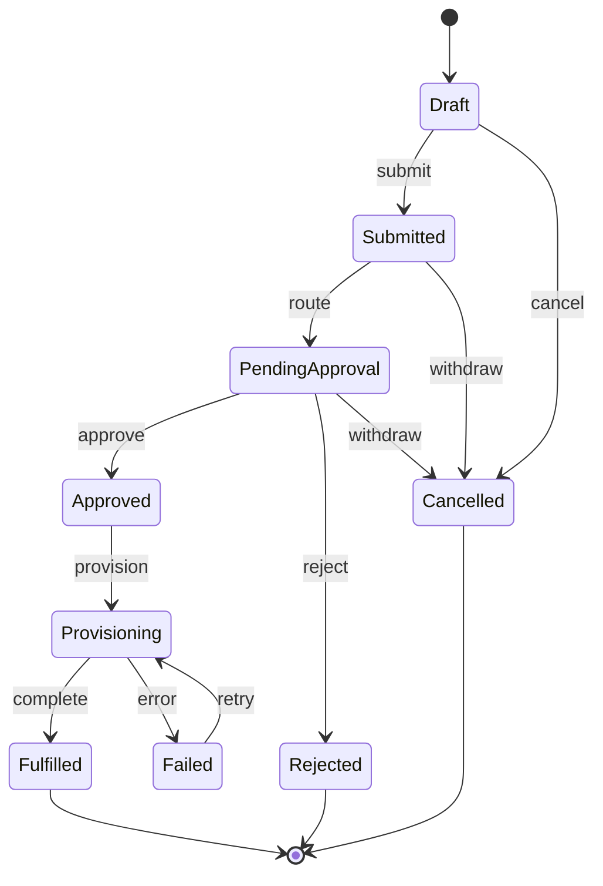

# Lifecycle State Machines

The states and legal transitions for each stateful entity. Source of truth:
`registries/product/lifecycle-states.json` (includes the **intent** for each state, which maps to
the Design System's status-chip colors: neutral / info / warning / success / error).

> Why this matters for UI: every status chip, filter option, kanban column, and "what can I do
> next" action button derives from these machines. Never invent a status not listed here.

## Access Request (the core loop)

## Approval Task
`Pending → Approved | Rejected | Escalated | Expired | Reassigned`. Escalated tasks can still be
Approved/Rejected. Drives the **Approvals inbox** filters and row actions.

## Certification Item
`Pending → Certified | Revoked | Delegated`. Delegated items return to Certified/Revoked. Drives
the **reviewer inbox** and bulk certify/revoke.

## Certification Campaign
`Draft → Active → (Overdue) → Completed`, or Cancelled. "Overdue" is time-driven and must be
visually distinct (warning intent) on campaign lists.

## SoD Violation
`Open → Acknowledged → Mitigated → Resolved`, with an `Exception Granted` branch. Open violations
are error-intent and should surface prominently on dashboards.

## Emergency Access
`Requested → Active → Expired → Under Review → Reviewed` (or Revoked). **Auto-expiry** is central —
active grants must always show a countdown to `expiresAt`.

## Account
`Active ↔ Disabled`, `Active → Orphaned → (reassign) Active`, `Disabled → Deleted`. Orphaned =
warning intent everywhere.

## Identity
`Active → Leaver Pending → Terminated`, plus `Active ↔ Inactive`. Leaver Pending triggers the
leaver journey.

## UX rules derived from state machines
- **Row/detail actions = the outgoing transitions** of the current state. If a state has no legal
  transition for the current persona, show no action (permission-aware + state-aware).
- **Filters = the state list** for that entity. Provide a "needs my action" shortcut mapping to
  the actionable state(s) for the current persona.
- **Terminal states** are read-only; make that obvious (no primary actions, muted styling).
