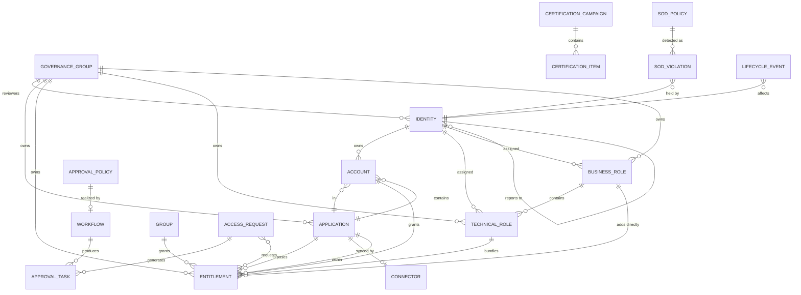

# Entity Relationships (ERD)

The canonical edges live in `registries/product/relationships.json`. This is the readable map.
Understanding these is what lets an AI build correct detail pages, tabs, and drill-downs.

> **User Identity** (`identity`) is the primary representation of a person; **App Account**
> (`account`) is that person's login in one application. **Technical Role** and **Business Role**
> are distinct entities: a Business Role contains Technical Roles (and may add entitlements
> directly), a Technical Role bundles entitlements.

## The three relationship "spines" to know
1. **Access spine** — `User Identity → App Account → Application`, and
   `User Identity → Technical/Business Role → Entitlement`.
   *An identity's access is the union of entitlements from its accounts + entitlements from its
   roles (Business Role → Technical Role → Entitlement) + entitlements from groups.* This
   "effective access" view is what most screens display.
2. **Request spine** — `Access Request → Approval Task(s)` via a `Workflow` shaped by an
   `Approval Policy`. This is the core loop's data path.
3. **Governance spine** — `Governance Group` **owns** applications/entitlements/roles and holds
   the reviewers; `Certification Campaign → Certification Items` reviews the access spine; and
   `SoD Policy → SoD Violations` constrains it. Every governable entity also has **Assigned
   Owners** (User Identities).

## Practical implications for UI
- **Default detail-page tabs** per Directory entity are specified in `data-dictionary.md`.
- **Assigned Owners / Reviewers** are always User Identities — resolve to avatar + name + email.
- **Effective access is computed**, not stored flat — surface *why* an identity has access
  (direct / via Technical Role X / via Business Role Y / via group Z). This provenance is a
  first-class UI need.
- **Cross-navigation**: relationship tabs list related entities and each row links to that
  entity's own detail page (Entitlement → Technical Roles → that role's page, etc.).
- **Orphan accounts** (`account.identityId = null`) must be visually flaggable everywhere
  accounts appear.
